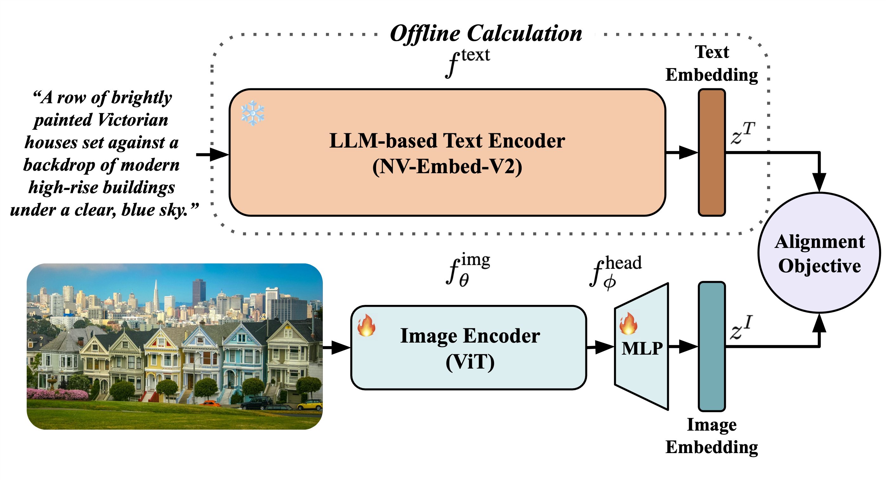

# 🚀 LIFT: Language-Image Alignment with Fixed Text Encoders

Currently, the most dominant approach to establishing language-image alignment is to pre-train (always from scratch) text and image encoders jointly through contrastive learning, such as CLIP and its variants. <b><i>In this work, we question whether such a costly joint training is necessary.</i></b> We investigate if a pre-trained fixed large language model (LLM) offers a good enough text encoder to guide visual representation learning.

<p align="center"> 
  
</p>

The pipeline of LIFT, which adopts a dual-tower architecture similar to CLIP. LIFT uses an LLM-based text encoder $f^{\text{text}}$ to pre-compute the embedding $z^T$ for each text sample $T$ <b><i>offline</i></b>. During training, we solely update the image encoder $f_{\theta}^{\text{img}}$ and the projection head $f_{\phi}^{\text{head}}$ to align image embeddings with the pre-computed text embeddings by optimizing an alignment objective.</p>

> [**Language-Image Alignment with Fixed Text Encoders**]()            
> [Jingfeng Yang*](https://jingfeng0705.github.io/), [Ziyang Wu*](https://robinwu218.github.io/), [Yue Zhao](https://www.linkedin.com/in/zhaoyue---/), [Yi Ma](https://people.eecs.berkeley.edu/~yima/),  
> UC Berkeley, The University of Hong Kong               

[[`project page`](https://jingfeng0705.github.io/LIFT/)] [[`arxiv`](https://arxiv.org/abs/2506.04209)] [[`pdf`](https://arxiv.org/pdf/2506.04209)] [[`bibtex`](#citation)]             


## Updates
- 🚀 06/03/2025: Initial commit. We release the code and the model checkpoints!


## Features

<p align="center"> 
  
</p>

- **LIFT Encodes Compositional Information Much Better!** LIFT outperforms CLIP by an average accuracy gain of **7.4%** across seven compositional understanding tasks and also leads CLIP on five out of six LLaVA downstream tasks, all driven by its superior ability to
encode compositional information.
- **LIFT Learns from Long Captions Much Better!**  When trained on short captions, CLIP has a slight edge over LIFT on three zero-shot retrieval tasks and one LLaVA downstream task. However, all of these advantages transfer to LIFT when both are trained on long (usually synthesized) captions. We attribute LIFT's better performance on long captions to its robustness against the <i>inverse effect</i> induced by syntactically homogeneous captions.
- **LIFT Is Much More Efficient in Terms of FLOPs and Memory Footprint!** Given average per-batch max caption token length $n$, the FLOPs and memory footprint of CLIP scale with $\mathcal{O}(n^2)$ complexity, whereas LIFT achieves $\mathcal{O}(1)$ amortized complexity. On average, LIFT reduces FLOPs by **25.5%** for short captions and **35.7%** for long ones, while lowering memory usage by **6.8%** and **12.6%**.


## Installation
Please install the conda environment and the required packages using the following commands:
```bash
conda create --name lift python=3.10.16 -y
conda activate lift
conda install pytorch torchvision torchaudio pytorch-cuda=12.1 -c pytorch -c nvidia
python -m pip install -r requirements.txt
```

## Dataset Preparation
See [Preparing Datasets for LIFT](./DATASET.md).


## Evaluation

We support the evaluation of four vision-language model tasks: 
- [SugarCrepe](https://github.com/RAIVNLab/sugar-crepe), which specifically tests models' compositional understanding
- Zero-shot classification on ImageNet-1K validation set
- Image-to-text (I2T) and text-to-image (T2I) retrieval on COCO Val2017 split
- Image-to-text (I2T) and text-to-image (T2I) retrieval on Flickr30K test set

Please first read the [instructions](./DATASET.md) to organize the evaluation dataset and specify `CONFIG` and your evaluation task in [evaluate.sh](scripts/evaluate.sh). Then, in the [evaluation config](evaluation/configs), please fill in
1. The path to the evaluation dataset `data_path`.
2. The path to the checkpoint `pretrained`.
3. If you are evaluating LIFT, the path to the LLM-based text encoder `llm_model`. Our checkpoints use [NV-Embed-V2](https://huggingface.co/nvidia/NV-Embed-v2) as their `llm_model`.

Then run the following command:
```bash
bash scripts/evaluate.sh
```
Below we highlight some results here. We also provide the [model checkpoints](#model-zoo).
### SugarCrepe
<table>
    <thead>
        <tr>
            <th rowspan="2" style="text-align:center;">Models</th>
            <th rowspan="2" style="text-align:center;">Backbone</th>
            <th rowspan="2" style="text-align:center;">Dataset</th>
            <th rowspan="2" style="text-align:center;">Sample Seen</th>
            <th colspan="2" style="text-align:center;">Add</th>
            <th colspan="3" style="text-align:center;">Replace</th>
            <th colspan="3" style="text-align:center;">Swap</th>
        </tr>
        <tr>
            <th style="text-align:center;">Obj</th>
            <th style="text-align:center;">Att</th>
            <th style="text-align:center;">Obj</th>
            <th style="text-align:center;">Att</th>
            <th style="text-align:center;">Rel</th>
            <th style="text-align:center;">Obj</th>
            <th style="text-align:center;">Att</th>
        </tr>
    </thead>
    <tbody>
        <tr>
            <td align="center">CLIP</td>
            <td align="center">ViT-B/16</td>
            <td align="center">DataComp</td>
            <td align="center">1.28B</td>
            <td align="center">82.3</td>
            <td align="center">73.7</td>
            <td align="center">91.7</td>
            <td align="center">79.4</td>
            <td align="center">61.2</td>
            <td align="center">59.6</td>
            <td align="center">56.9</td>
        </tr>
        <tr>
            <td align="center">LIFT</td>
            <td align="center">ViT-B/16</td>
            <td align="center">DataComp</td>
            <td align="center">1.28B</td>
            <td align="center"><b>89.0</b></td>
            <td align="center"><b>86.1</b></td>
            <td align="center"><b>93.2</b></td>
            <td align="center"><b>86.0</b></td>
            <td align="center"><b>70.6</b></td>
            <td align="center"><b>64.1</b></td>
            <td align="center"><b>63.4</b></td>
        </tr>
        <tr>
            <td align="center">CLIP</td>
            <td align="center">ViT-B/16</td>
            <td align="center">Recap</td>
            <td align="center">512M</td>
            <td align="center">77.0</td>
            <td align="center">73.7</td>
            <td align="center">88.9</td>
            <td align="center">80.8</td>
            <td align="center">63.4</td>
            <td align="center">62.0</td>
            <td align="center"><b>76.3</b></td>
        </tr>
        <tr>
            <td align="center">LIFT</td>
            <td align="center">ViT-B/16</td>
            <td align="center">Recap</td>
            <td align="center">512M</td>
            <td align="center"><b>88.8</b></td>
            <td align="center"><b>92.2</b></td>
            <td align="center"><b>92.3</b></td>
            <td align="center"><b>88.2</b></td>
            <td align="center"><b>76.8</b></td>
            <td align="center"><b>66.5</b></td>
            <td align="center">72.8</td>
        </tr>
    </tbody>
</table>


### Zero-shot Retrieval
<table>
    <thead>
        <tr>
            <th rowspan="2" style="text-align:center;">Models</th>
            <th rowspan="2" style="text-align:center;">Backbone</th>
            <th rowspan="2" style="text-align:center;">Dataset</th>
            <th rowspan="2" style="text-align:center;">Sample Seen</th>
            <th rowspan="2" style="text-align:center;">ImageNet</th>
            <th colspan="2" style="text-align:center;">COCO</th>
            <th colspan="2" style="text-align:center;">Flickr</th>
        </tr>
        <tr>
            <th style="text-align:center;">I2T</th>
            <th style="text-align:center;">T2I</th>
            <th style="text-align:center;">Obj</th>
            <th style="text-align:center;">Att</th>
        </tr>
    </thead>
    <tbody>
        <tr>
            <td align="center">CLIP</td>
            <td align="center">ViT-B/16</td>
            <td align="center">DataComp</td>
            <td align="center">1.28B</td>
            <td align="center"><b>58.4</b></td>
            <td align="center"><b>31.0</b></td>
            <td align="center">27.2</td>
            <td align="center"><b>62.9</b></td>
            <td align="center">59.6</td>
        </tr>
        <tr>
            <td align="center">LIFT</td>
            <td align="center">ViT-B/16</td>
            <td align="center">DataComp</td>
            <td align="center">1.28B</td>
            <td align="center">58.3</td>
            <td align="center">29.1</td>
            <td align="center"><b>28.1</b></td>
            <td align="center">58.8</td>
            <td align="center"><b>63.7</b></td>
        </tr>
        <tr>
            <td align="center">CLIP</td>
            <td align="center">ViT-B/16</td>
            <td align="center">Recap</td>
            <td align="center">512M</td>
            <td align="center">34.6</td>
            <td align="center">25.7</td>
            <td align="center">26.7</td>
            <td align="center">56.4</td>
            <td align="center">57.9</td>
        </tr>
        <tr>
            <td align="center">LIFT</td>
            <td align="center">ViT-B/16</td>
            <td align="center">Recap</td>
            <td align="center">512M</td>
            <td align="center"><b>43.6</b></td>
            <td align="center"><b>34.6</b></td>
            <td align="center"><b>36.0</b></td>
            <td align="center"><b>69.1</b></td>
            <td align="center"><b>72.9</b></td>
        </tr>
    </tbody>
</table>


### Model Zoo
<table><tbody>
<!-- START TABLE -->
<!-- TABLE HEADER -->
<th valign="center">Models</th>
<th valign="center">Checkpoints</th>
<th valign="center">Backbone</th>
<th valign="center">Dataset</th>
<th valign="center">Sample Seen</th>
<!-- TABLE BODY -->
</tr>
<tr><td align="center">CLIP</td>
<td valign="center"><a href="https://drive.google.com/file/d/1jMYMlXpNBHCq6hW8DwBma9gbC0dl4-bv/view?usp=sharing">Download</a></td>
<td valign="center">ViT-B/16</th>
<td align="center">DataComp</td>
<td align="center">1.28B</td>
</tr>

<tr><td align="center">LIFT</td>
<td valign="center"><a href="https://drive.google.com/file/d/1pIcVeFeaWlCar9Z_3YKwk7d9qlxvVT4H/view?usp=sharing">Download</a></td>
<td valign="center">ViT-B/16</th>
<td align="center">DataComp</td>
<td align="center">1.28B</td>
</tr>

<tr><td align="center">CLIP</td>
<td valign="center"><a href="https://drive.google.com/file/d/1d-zmpt03HaquiLrGBS2RvRqZHsoJ76bM/view?usp=sharing">Download</a></td>
<td valign="center">ViT-B/16</th>
<td align="center">Recap</td>
<td align="center">512M</td>
</tr>

<tr><td align="center">LIFT</td>
<td valign="center"><a href="https://drive.google.com/file/d/1OjYqAy5lO5o3TOEeyAklsZ6HwcZPajqL/view?usp=sharing">Download</a></td>
<td valign="center">ViT-B/16</th>
<td align="center">Recap</td>
<td align="center">512M</td>
</tr>
</tbody></table>


## Offline Embeddings Generation

We provide the script to generate caption embeddings offline using an LLM-based text encoder. First, please read the [instructions](./DATASET.md) to organize the raw caption folder and specify `CONFIG` in [embed.sh](scripts/embed.sh). Then, in the [embeddings generation config](./embed_label/configs), please fill in
1. The path to the raw caption folder `raw_text_data`.
2. The path to the destination folder of caption embeddings `embedded_labels`.
2. The path to the LLM-based text encoder `llm_model`.
4. The total number of raw captions to be embedded `raw_text_num_samples`.

Then run the following command:
```bash
bash scripts/embed.sh
```


## Training

We provide the training script to replicate LIFT and CLIP reported in the paper. First, please read the [instructions](./DATASET.md) to organize the image, raw caption, and caption embedding folders and specify `CONFIG` in [train.sh](scripts/train.sh). Then, in the [training config](LIFT/configs), please fill in
1. The path to the image folder `train_data`
2. If you are training CLIP, the path to the raw caption folder `raw_text_data`.
3. If you are training LIFT, the path to the caption embedding folder `embedded_text_data`. 

Then run the following command:
```bash
bash scripts/train.sh
```

## How to get support from us?
If you have any general questions, feel free to email us at [Jingfeng Yang](mailto:yangjingfeng0705@berkeley.edu). If you have code or implementation-related questions, please feel free to send emails to us or open an issue in this codebase (We recommend that you open an issue in this codebase, because your questions may help others). 

## Citation
If you find our work inspiring, please consider giving a star ⭐ and a citation!
```
@misc{yang2025languageimagealignmentfixedtext,
      title={Language-Image Alignment with Fixed Text Encoders}, 
      author={Jingfeng Yang and Ziyang Wu and Yue Zhao and Yi Ma},
      year={2025},
      eprint={2506.04209},
      archivePrefix={arXiv},
      primaryClass={cs.CV},
      url={https://arxiv.org/abs/2506.04209}, 
}
```

## Acknowledgement
This codebase is built on top of [OpenCLIP](https://github.com/mlfoundations/open_clip), [Webdataset](https://github.com/webdataset/webdataset), [SugarCrepe](https://github.com/RAIVNLab/sugar-crepe), and [SuperClass](https://github.com/x-cls/superclass). The source code of the README page is borrowed from [UnSAM](https://github.com/frank-xwang/UnSAM). We appreciate the authors for open-sourcing their codes.