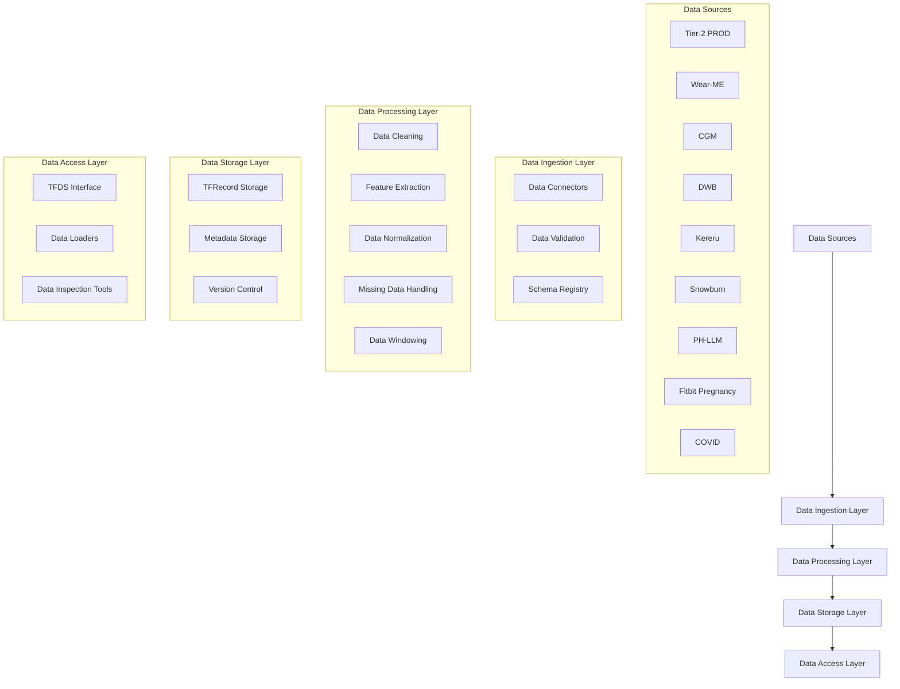

Please read through the design requirement and  design proposal for a unified data pipeline. Please revise the doc to be more specific to Google tools, such as JAX, Scenic, Tensorflow, CNS, Flume, Borg, Colab, Spanner etc. Try to reduce dependency on Google Cloud. DO NOT use tools specific to Google Cloud
<design_requirement>


# Data Pipeline Planning for Sensor Foundation Models

This document outlines the planning for data pipelines designed for training sensor foundation models. It covers dataset identification, unification, tool selection, and other key considerations.

# 1\. Dataset Identification

The first step is to identify all existing datasets that could be used to train sensor foundation models.

Here are the currently identified datasets:

| Dataset | Areas | Sandbox CNS | Label CNS |
| :---- | :---- | :---- | :---- |
| Tier-2 PROD | Activity, Mental |  |  |
| Wear-ME | Metabolic, Sleep, Mental |  |  |
| CGM | Metabolic |  |  |
| DWB | Sleep, Mental |  |  |
| Kereru | Sleep |  |  |
| Snowburn | Activity |  |  |
| PH-LLM | Sleep, Activity |  |  |
| Fitbit Pregnancy  | Women, Mental  |  |  |
| COVID |  |  |  |

# 2\. Unified Dataset Construction

To train effective foundation models, it's crucial to construct a unified dataset that integrates data from multiple sources.

Key considerations for unification include:

* **Data Filtering**  
  * Label selection   
  * Demographics selection   
  * Missing selection   
  * Subject number selection    
* **Centralized Data Meta Data Class**   
  * Sensor data location   
  * Label location   
  * Label types   
* **Label Processing Class per Dataset**  
  * Metabolic  
  * Wear-ME  
  * DWB   
  * …  
* **Centralized Sensor Processing Class**   
  * HR  
  * STEP  
  * …  
* **Centralized Caption Generation Class**   
  * Dataset 

We do not have to necessarily use \`Flume\` on all these datasets and tasks.   


</design_requirement>

<design_proposal>
# LSM Unified Data Pipeline Architecture

This document outlines the architecture for a unified data pipeline designed to process sensor data from multiple sources for training Large Sensor Models (LSM). The pipeline is designed to be flexible, scalable, and support both batch processing (using Flume) and parallel processing in Colab/CLI environments.

## 1. Pipeline Overview



## 2. Core Components

### 2.1 Data Ingestion Layer

#### Data Connectors
- Standardized connectors for each data source
- Support for both batch and streaming ingestion
- Automatic schema detection and validation
- Timezone handling and standardization

#### Data Validation
- Schema validation
- Data quality checks
- Missing data detection
- Outlier detection

#### Schema Registry
- Centralized schema definitions
- Version control for schemas
- Schema evolution support

### 2.2 Data Processing Layer

#### Data Cleaning
- Standardized cleaning procedures per sensor type
- Handling of invalid/missing values
- Outlier removal
- Data type standardization

#### Feature Extraction
- Sensor-specific feature extraction
- Common feature set across datasets
- Feature validation and documentation

#### Data Normalization
- Standardized normalization procedures
- Per-feature normalization parameters
- Support for different normalization strategies

#### Missing Data Handling
- Missing data detection
- Missing data imputation strategies
- Missing data masks generation

#### Data Windowing
- Configurable window sizes
- Overlap handling
- Window validation

### 2.3 Data Storage Layer

#### TFRecord Storage
- Efficient binary storage format
- Compression support
- Sharding for large datasets

#### Metadata Storage
- Dataset versioning
- Processing parameters
- Data quality metrics
- Feature statistics

#### Version Control
- Dataset versioning
- Processing pipeline versioning
- Schema versioning

### 2.4 Data Access Layer

#### TFDS Interface
- Standardized TensorFlow Dataset interface
- Support for different splits (train/val/test)
- Efficient data loading

#### Data Loaders
- Batch processing support
- Streaming support
- Parallel processing support

#### Data Inspection Tools
- Data quality visualization
- Feature distribution analysis
- Missing data analysis

## 3. Implementation Details

### 3.1 Processing Pipeline

```python
class LSMDatasetProcessor:
    def __init__(self, config: Dict[str, Any]):
        self.config = config
        self.schema_registry = SchemaRegistry()
        self.feature_extractor = FeatureExtractor()
        self.normalizer = DataNormalizer()
        
    def process_dataset(self, data_source: str) -> tf.data.Dataset:
        # 1. Data Ingestion
        raw_data = self.ingest_data(data_source)
        
        # 2. Data Validation
        validated_data = self.validate_data(raw_data)
        
        # 3. Feature Extraction
        features = self.extract_features(validated_data)
        
        # 4. Data Normalization
        normalized_data = self.normalize_data(features)
        
        # 5. Missing Data Handling
        processed_data = self.handle_missing_data(normalized_data)
        
        # 6. Data Windowing
        windowed_data = self.create_windows(processed_data)
        
        # 7. TFRecord Generation
        return self.create_tfrecords(windowed_data)
```

### 3.2 Configuration Management

```python
@dataclass
class PipelineConfig:
    # Data Source Configuration
    data_sources: List[str]
    schema_version: str
    
    # Processing Configuration
    window_size: int
    overlap: float
    missing_threshold: float
    
    # Feature Configuration
    features_to_include: List[str]
    normalization_params: Dict[str, Tuple[float, float]]
    
    # Storage Configuration
    output_format: str
    compression: bool
    shard_size: int
```

### 3.3 Feature Processing

```python
class FeatureProcessor:
    def __init__(self, feature_config: Dict[str, Any]):
        self.feature_config = feature_config
        
    def process_feature(self, feature_name: str, data: np.ndarray) -> np.ndarray:
        # 1. Feature-specific cleaning
        cleaned_data = self.clean_feature(feature_name, data)
        
        # 2. Feature-specific normalization
        normalized_data = self.normalize_feature(feature_name, cleaned_data)
        
        # 3. Feature-specific validation
        validated_data = self.validate_feature(feature_name, normalized_data)
        
        return validated_data
```

## 4. Usage Examples

### 4.1 Batch Processing (Flume)

```python
def create_flume_pipeline():
    pipeline = beam.Pipeline()
    
    # 1. Read from data sources
    raw_data = (
        pipeline
        | 'ReadData' >> beam.io.ReadFromSource()
        | 'ValidateData' >> beam.Map(validate_data)
    )
    
    # 2. Process data
    processed_data = (
        raw_data
        | 'ExtractFeatures' >> beam.Map(extract_features)
        | 'NormalizeData' >> beam.Map(normalize_data)
        | 'HandleMissingData' >> beam.Map(handle_missing_data)
        | 'CreateWindows' >> beam.Map(create_windows)
    )
    
    # 3. Write to TFRecords
    processed_data | 'WriteTFRecords' >> beam.io.WriteToTFRecord(
        output_path,
        file_name_suffix='.tfrecord'
    )
```

### 4.2 Parallel Processing (Colab/CLI)

```python
def process_dataset_parallel():
    # 1. Initialize processor
    processor = LSMDatasetProcessor(config)
    
    # 2. Create processing pool
    with Pool(processes=num_processes) as pool:
        # 3. Process data sources in parallel
        results = pool.map(
            processor.process_dataset,
            data_sources
        )
    
    # 4. Combine results
    combined_dataset = tf.data.Dataset.from_tensor_slices(results)
    
    # 5. Save dataset
    processor.save_dataset(combined_dataset)
```

## 5. Data Quality and Monitoring

### 5.1 Quality Metrics
- Missing data ratio per feature
- Data distribution statistics
- Outlier detection
- Feature correlation analysis

### 5.2 Monitoring
- Processing pipeline metrics
- Data quality metrics
- Resource utilization
- Error tracking

## 6. Future Improvements

1. **Scalability**
   - Distributed processing support
   - Incremental processing
   - Caching mechanisms

2. **Flexibility**
   - Custom feature extraction
   - Custom normalization
   - Custom windowing

3. **Monitoring**
   - Real-time quality metrics
   - Automated alerting
   - Performance optimization

4. **Documentation**
   - Automated documentation generation
   - Data lineage tracking
   - Processing history

## 7. Implementation Notes

1. All code should be written in Python 3.x
2. Use TensorFlow 2.x for data processing
3. Follow Google's Python style guide
4. Include comprehensive unit tests
5. Document all public APIs
6. Use type hints for better code maintainability
7. Implement proper error handling and logging
8. Support both CPU and GPU processing
9. Include data validation at each step
10. Implement proper versioning for all components 
</design_proposal>
